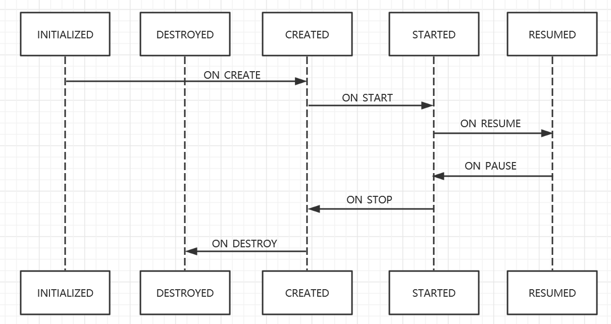

# Lifecycle

## 基本概念

```
Lifecycle可以有效的避免内存泄漏和解决android生命周期的常见难题
Livecycle   是一个表示android生命周期及状态的对象
LivecycleOwner  用于连接有生命周期的对象，如activity,fragment
LivecycleObserver  用于观察查LifecycleOwner

Lifecycle框架使用观察者模式实现观察者监听被观察者的生命周期的变化
```


## 完成订阅关系

```kotlin
class MyObserver : LifecycleObserver {
    @OnLifecycleEvent(Lifecycle.Event.ON_RESUME)
    fun connectListener() {}
    
    @OnLifecycleEvent(Lifecycle.Event.ON_PAUSE)
    fun disconnectListener() {}
}
```

```
getLifecycle().addObserver(listener);
```


## 原理

### 被观察者

```java
ComponentActivity implements LifecycleOwner {
    // 聚合多个LifecycleObserver观察者,生命周期改变时会相应的通知
	private final LifecycleRegistry mLifecycleRegistry = new LifecycleRegistry(this);
    
    protected void onCreate(@Nullable Bundle savedInstanceState) {
        super.onCreate(savedInstanceState);
        ReportFragment.injectIfNeededIn(this);
        	if (Build.VERSION.SDK_INT >= 29) {
                activity.registerActivityLifecycleCallbacks(new LifecycleCallbacks());
            }
        	android.app.FragmentManager manager = activity.getFragmentManager();
            if (manager.findFragmentByTag(REPORT_FRAGMENT_TAG) == null) {
                // 添加空白fragment
                manager.beginTransaction().add(new ReportFragment(), REPORT_FRAGMENT_TAG).commit();
                manager.executePendingTransactions();
            }
    }
    
	public Lifecycle getLifecycle() {
        return mLifecycleRegistry;
    }
}
```


### LifecycleRegistry.addObserver流程

```java
State initialState = mState == DESTROYED ? DESTROYED : INITIALIZED;
// 包装到 ObserverWithState
ObserverWithState statefulObserver = new ObserverWithState(observer, initialState);
	mLifecycleObserver = Lifecycling.lifecycleEventObserver(observer);
		// 创建 ReflectiveGenericLifecycleObserver
		return new ReflectiveGenericLifecycleObserver(object);
			mWrapped = wrapped;
			mInfo = ClassesInfoCache.sInstance.getInfo(mWrapped.getClass());
				existing = createInfo(klass, null);
					CallbackInfo info = new CallbackInfo(handlerToEvent);
                    mCallbackMap.put(klass, info);
                    mHasLifecycleMethods.put(klass, hasLifecycleMethods);
                    return info;
				return existing;
// 存入mObserverMap
ObserverWithState previous = mObserverMap.putIfAbsent(observer, statefulObserver);

while ((statefulObserver.mState.compareTo(targetState) < 0 && mObserverMap.contains(observer))) {
    pushParentState(statefulObserver.mState);
    statefulObserver.dispatchEvent(lifecycleOwner, upEvent(statefulObserver.mState));
    popParentState();
    targetState = calculateTargetState(observer);
}

if (!isReentrance) {
    sync();
}
```


### 空白fragment

```java
@Override
public void onActivityCreated(Bundle savedInstanceState) {
    super.onActivityCreated(savedInstanceState);
    dispatchCreate(mProcessListener);
    dispatch(Lifecycle.Event.ON_CREATE);
}

private void dispatchCreate(ActivityInitializationListener listener) {
    if (listener != null) {
        listener.onCreate();
    }
}

private void dispatch(@NonNull Lifecycle.Event event) {
	if (Build.VERSION.SDK_INT < 29) {
		dispatch(getActivity(), event);
	}
}

static void dispatch(@NonNull Activity activity, @NonNull Lifecycle.Event event) {
    if (activity instanceof LifecycleRegistryOwner) {
        ((LifecycleRegistryOwner) activity).getLifecycle().handleLifecycleEvent(event);
        return;
    }
    if (activity instanceof LifecycleOwner) {
        Lifecycle lifecycle = ((LifecycleOwner) activity).getLifecycle();
        if (lifecycle instanceof LifecycleRegistry) {
            // 分发事件
            ((LifecycleRegistry) lifecycle).handleLifecycleEvent(event);
        }
    }
}
```


### 事件分发流程

```java
public void handleLifecycleEvent(@NonNull Lifecycle.Event event) {
        State next = getStateAfter(event);
        moveToState(next);
}

static State getStateAfter(Event event) {
    switch (event) {
        case ON_CREATE:
        case ON_STOP:
            return CREATED;
        case ON_START:
        case ON_PAUSE:
            return STARTED;
        case ON_RESUME:
            return RESUMED;
        case ON_DESTROY:
            return DESTROYED;
        case ON_ANY:
            break;
    }
}

private void moveToState(State next) {
    if (mState == next) {
        return;
    }
    mState = next;
    if (mHandlingEvent || mAddingObserverCounter != 0) {
        mNewEventOccurred = true;
        return;
    }
    mHandlingEvent = true;
    sync();
    mHandlingEvent = false;
}

private void sync() {
    LifecycleOwner lifecycleOwner = mLifecycleOwner.get();
    while (!isSynced()) {
        mNewEventOccurred = false;
        if (mState.compareTo(mObserverMap.eldest().getValue().mState) < 0) {
            // 状态倒退
            backwardPass(lifecycleOwner);
        }
        Entry<LifecycleObserver, ObserverWithState> newest = mObserverMap.newest();
        if (!mNewEventOccurred && newest != null && mState.compareTo(newest.getValue().mState) > 0) {
            // 状态前进
            forwardPass(lifecycleOwner);
        }
    }
    mNewEventOccurred = false;
}

private void backwardPass(LifecycleOwner lifecycleOwner) {
    // 从mObserverMap 取出
    Iterator<Entry<LifecycleObserver, ObserverWithState>> descendingIterator = mObserverMap.descendingIterator();
    while (descendingIterator.hasNext() && !mNewEventOccurred) {
        Entry<LifecycleObserver, ObserverWithState> entry = descendingIterator.next();
        // ObserverWithState 中的 LifecycleEventObserver == ReflectiveGenericLifecycleObserver(object);
        ObserverWithState observer = entry.getValue();
        // 状态比较
        while ((observer.mState.compareTo(mState) > 0 && !mNewEventOccurred && mObserverMap.contains(entry.getKey()))) {
            Event event = downEvent(observer.mState);
            pushParentState(getStateAfter(event));
            // 分发
            observer.dispatchEvent(lifecycleOwner, event);
            popParentState();
        }
    }
}
```

### observer.dispatchEvent

```java
static class ObserverWithState {
	void dispatchEvent(LifecycleOwner owner, Event event) {
        State newState = getStateAfter(event);
        mState = min(mState, newState);
        //ReflectiveGenericLifecycleObserver.onStateChanged
        mLifecycleObserver.onStateChanged(owner, event);
        	// 反射调用观察者方法
        	mInfo.invokeCallbacks(source, event, mWrapped);
        mState = newState;
    }
}
```




