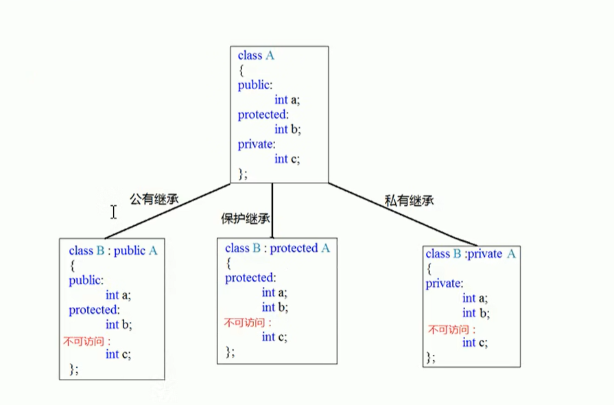

# C++学习


## 常量

宏常量

```c++
#define Day 7
```

const修饰的变量

```c++
const int month = 7;
```


## sizeof

查看数据类型所占内存大小

```c++
sizeof(short);//2
sizeof(int);//4
sizeof(long);//4
sizeof(long long);//8

// short < int <= long <= longlong 
```


## goto

语法:goto 标记;

```c++
goto FLAG;

FLAG:
```


## 数组

```c++
int arr[10] = { 1,2,3,4,5,6,7,8,9,10 };
cout << "整个数组占用的空间:" << sizeof(arr) << endl;
cout << "每个元素占用的空间:" << sizeof(arr[0]) << endl;
cout << "数组中的元素个数:" << sizeof(arr) / sizeof(arr[0]) << endl;

cout << "数组首地址:" << arr << endl;
cout << "数组首地址:" << &arr[0] << endl;
```

定义方式

```c++
// 1
int arr[5];
arr[0] = 1;

// 2 
// 如果在初始化时，未全部填完，会用0来填补剩余数据
int arr2[5] = {1};

// 3
// 必须初始化长度
int arr3[] = {1,...};
```


## 二维数组

```c++
int arr[2][3] = 
{
	{1,2,3},
	{4,5,6}
};
cout << "二维数组占用的空间:" << sizeof(arr) << endl;
cout << "二维数组第一行占用的空间:" << sizeof(arr[0]) << endl;
cout << "二维数组第一个元素占用的空间:" << sizeof(arr[0][0]) << endl;

cout << "二维数组数组行数:" << sizeof(arr) / sizeof(arr[0]) << endl;
cout << "二维数组数组列数:" << sizeof(arr[0]) / sizeof(arr[0][0]) << endl;

cout << "二维数组首地址:" << arr << endl;
cout << "二维数组第一行首地址:" << arr[0] << endl;
cout << "二维数组第二行首地址:" << arr[1] << endl;
cout << "二维数组第一行第一个元素首地址:" << &arr[0][0] << endl;
```


## 函数值传递

函数值传递时，函数的形参发生改变，并不会影响实参的值

```c++
void swap(int num1,int num2) {
	int temp = num1;
	num1 = num2;
	num2 = temp;
}
```


## 指针

作用：通过指针间接访问内存

```c++
int a = 10;
int* p = &a;

cout << "a的地址:" << &a << endl;
cout << "指针p为:" << p << endl;

//指针前加 * 代表解引用，找到指针指向的内存中的数据
*p = 100;
cout << "a:" << a << endl;
cout << "*p:" << *p << endl;
```


### 指针占用内存空间

32位系统占用4字节

64位系统占用8字节

```c++
sizeof(int *)
```


### 空指针

指针变量指向内存中编号为0的空间

用途：初始化指针变量

注意：空指针指向的内存是不可访问的

```c++
int * p = NULL;
// 0 ~ 255 之间的内存编号是系统占用的，因此不能访问
cout << *p << endl;
```


### 野指针

指针变量指向非法的内存空间

```c++
int * p = (int *)0x1100;
```


### const修饰指针

```c++
int a = 10;
int b = 20;

// 常量指针
// 特点:指针指向能修改，指针指向的值不能修改
const int * p1 = &a;
*p1 = 20;//错误,指针指向的值不能修改
p1 = &b;//正确,指针指向能修改

// 指针常量
// 特点:指针指向不能修改，指针指向的值能修改
int * const p2 = &a;
*p2 = 20;//正确,指针指向的值能修改
p2 = &b;//错误,指针指向不能修改

// 常量指针常量
// 特点：指针指向 和 指针指向的值 都不可以改
const int * const p3 = &a;
*p3 = 20;//错误,指针指向的值不能修改
p3 = &b;//错误,指针指向不能修改

```

记忆法:

const在 int * p前，代表 *p不能改

const在 p前，代表 p不能改


### 指针访问数组

```c++
int arr[10] = { 1,3,3,4,5,6,7,8,9,10 };
int* p = arr;

cout << "第一个元素:" << arr[0] << endl;
cout << "指针访问第一个元素:" << *p << endl;
p++; // 指针向后偏移4个字节
cout << "指针访问第二个元素:" << *p<< endl;
```


### 地址传递

利用指针作函数参数，可以修改实参的值

```c++
void swap(int * p1, int * p2) {
	int temp = *p1;
	*p1 = *p2;
	*p2 = temp;
}

int main() {
	int a = 10;
	int b = 20;
	swap(&a, &b);
	cout << "a:" << a << endl;
	cout << "b:" << b << endl;
	return 0;
}
```


## 结构体

```c++
struct student {
	string name;
	int age;
	int score;
}s1;// s1为结构体变量，可省略，分号不能漏


// 使用
struct student stu;
stu.name = "cq";
stu.age = 18;
stu.score = 100;
```


### 结构体指针

利用->操作符可以通过结构体指针访问结构体属性


### 结构体函数参数

```c++
// 值传递，形参修改后不会影响实参
void modifyScore(struct student stu) {
	stu.score = 80;
}
// 地址传递,形参修改会影响实参
void modifyScore2(struct student * stu) {
	stu->score = 90;
}

int main() {
	struct student stu = {"cq", 18, 100};
	modifyScore(stu);
	cout << stu.score << endl;// 100
	modifyScore2(&stu);
	cout << stu.score << endl;// 90
	return 0;
}
```


## 内存四区

- 代码区：存放函数体的二进制代码，由操作系统进行管理
- 全局区：存放全局变量、静态变量、常量
- 栈区：由编译器自动分配释放，存放函数的参数值，局部变量等
- 堆区：由程序员分配和释放，若程序员不释放，程序结束时由操作系统回收


程序运行前:代码区、全局区

程序运行后:栈区、堆区


### 代码区：

存放CPU执行的机器指令

代码区是共享的、只读的


### 全局区:

全局变量、静态变量、字符串常量、const修饰的全局变量(全局常量)

该区域的数据在程序结束后由操作系统释放

```c++
// 全局变量
int g_a = 10;
// 全局常量
const int c_g_a = 10;

int main() {
    // 局部变量(栈区，不在全局区)
    int a = 10;
    // const 修饰的局部变量(栈区，不在全局区)
    const int c_l_a = 10;
    
    // 静态变量
    static int s_a = 10;
    
    // 字符串常量
    "hello world";
    
    return 0;
}
```


### 栈区:

由编译器自动分配释放，存放函数的参数值，局部变量等

注意：不要返回局部变量的地址，栈区开辟的数据由编译器自动释放

```c++
int* func() { // 形参的数据也会放在栈区
    int a = 10; // 局部变量,存放在栈区,栈区的数据在函数执行后自动释放
    return &a; // 返回局部变量的地址
}

int main() {
    int *p = func();
    cout << *p << endl; // 10   第一次可以打印正确的数字是因为编译器做了保留
    cout << *p << endl; // xxxx 第二次这个数据就不在保留了
    return 0;
}
```


### 堆区:

由程序员分配和释放，若程序员不释放，程序结束时由操作系统回收

在C++中主要利用new在堆区开辟内存

```c++
int* func() {
    int* a = new int(10);
    return a;
}

int main() {
    int *p = func();
    cout << *p << endl; // 10
    cout << *p << endl; // 10
    return 0;
}
```


## new/delete

new 返回的是该数据类型的指针

delete 释放/释放数组也是用delete

```c++
int* arr = new int[10];
delete[] arr;
```


## 引用

作用：给变量取别名

```c++
int a = 10;
// 语法: 数据类型 &别名 = 原名
int &b = a;
b = 100;
cout << a << endl; // 打印a也是= 100
```


### 注意事项:

引用必须初始化

引用在初始化后,不能发生改变

```c++
int a = 10;
int c = 20;

//int &b; // 错误写法,引用必须初始化
int &b = a;
b = c; // 赋值操作,而不是更改引用
```


### 引用函数参数

作用：函数传参时，可以利用引用的技术让形参修饰实参

优点：简化指针修改实参

```c++
void swap(int &a, int &b) {
    int temp = a;
    a = b;
    b = temp;
}
int main() {
    int a = 10;
    int b = 20;
    swap(a, b); // a和b发生了改变
    
    return 0;
}
```


### 引用做函数返回值

注意：不要返回局部变量引用

```c++
// 返回局部变量引用
int& test1() {
    int a = 10;
    return a;
}

// 返回静态变量引用
int& test2() {
    static int a = 10;
    return a;
}

int main() {
    // 返回局部变量引用错误示范
    int &ref = test1();
    cout << ref << endl; // 第一次结果正确,是因为编译器做了保留
    cout << ref << endl; // 第二次结果错误,是因为a的内存已释放
    
    int &ref2 = test2();
    test2() = 1000; // 如果函数的返回值是引用，这个函数调用可以作为左值
    cout << ref2 << endl; // 输出1000
    
}
```


### 引用的本质

引用的本质在c++内部实现是一个指针常量

```c++
// 转化为: int* const ref = &a;
vod func(int& ref) {
    // 转化为 *ref = 100
    ref = 100;
}

int main() {
    int a = 10;
    int &ref = a; // 自动转换为 int* const ref = &a;
    ref = 20; // 自动转换为 *ref = 20
    
    func(a);
    return 0;
}
```


### 常量引用

```c++
// 利用常量引用防止误操作修改实参
void showValue(const int& ref) {
	// ref = 1000; 不能修改
}

// 加上const之后,编译器将代码修改为  int temp = 10;  const int &ref = temp;
const int &ref = 10;

// ref = 20; 错误, 加上const之后变为只读,不可以修改
```


## 类和对象

### class和struct区别

默认的访问权限不同

stuct：默认权限为公共

class：默认权限为私有


### 构造、析构和拷贝分类及调用 

注意事项1：调用默认构造函数时，不要加()

注意事项2：不要利用拷贝构造，初始化匿名对象

```c++
class Person {
public:
    // 构造函数 (无参构造、默认构造)
	Person() {
	}
    // 有参构造
    Person(int a) {
	}
    // 拷贝构造
    Person(const Person &p) {
        // 为什么要加const,防止修改本体
        // 为什么传引用，是否能去掉,去掉的话相当于多拷贝一份数据了，没必要
        
        // ... 省略赋值操作
    }
    // 析构函数
	~Person() {
        // 在对象销毁前默认会调用析构函数
	}
};

// 调用方式
void test() {
	// 括号法
    Person p; // 默认构造
    Person p2(10); // 有参构造
    Person p3(p2); // 拷贝构造
    
    // 注意事项1
    // 调用默认构造函数时，不要加()
    // 下面这行代码，编译器认为会是一个函数的声明
    // Person p1(); // 函数声明,不是创建对象     类似 void func();
    
    // 显示法
 	Person p1;
    Person p2 = Person(10);
    Person p3 = Person(p2);
    
    Person(10); // 匿名对象 特点：当前执行结束后，系统会立即回收掉匿名对象
    
    // 注意事项2
    // 不要利用拷贝构造，初始化匿名对象, 编译器会认为 Person(p3) 等价于 Person p3;  相当于对象声明
    // Person(p3);
    
    // 隐式转换法
    Person p4 = 10; // 相当于 Person p4 = Person(10);
    Person p5 = p4; // 拷贝构造
    
}
```


###  拷贝构造函数调用时机

1.使用已经创建完毕的对象初始化一个新对象

```c++
Person p1;
Person p2(p1); // 调用拷贝构造
```

2.值传递方式给函数参数传值

```c++
void test(Person p) {
}

Person p;
test(p); // 调用拷贝构造
```


3.以值方式返回局部对象

```c++
Person test() {
    Person p;
    return p;
}

Person p = test(); // 调用拷贝构造
```


### 构造函数调用规则

默认情况下，c++编译器至少给一个类添加3个函数

1.默认无参构造函数

2.默认析构函数

3.默认拷贝构造函数

规则:

- 如果用户定义有参构造函数，c++不再提供默认无参构造，但是会提供默认拷贝构造
- 如果用户定义拷贝构造函数，c++不会再提供其他构造函数


### 深拷贝与浅拷贝

浅拷贝：简单的赋值拷贝操作

深拷贝：在堆区重新申请空间，进行拷贝操作


浅拷贝问题：堆区内存重复释放

```c++
Person(const Person &p) {
    // mAge = p.mAge; 浅拷贝操作
    
    // 深拷贝 解决 浅拷贝在堆区内存重复释放的问题
    mAge = new int(*p.mAge);
}
~Person() {
    if (mAge != NULL) {
        delete mAge;
        mAge = NULL;
    }
}
```


总结：如果属性在堆区开辟的，一定要自己提供拷贝构造函数，防止浅拷贝带来的问题


### 初始化列表

```c++
Person(int a, int b, int c) :m_A(a), m_B(b), m_C(c) {   
}
```


### 类对象作为类成员

构造顺序：先调用对象成员的构造，在调用本类的构造

析构顺序：与构造顺序相反


### 静态成员

- 静态成员变量
  - 所有对象共享同一份数据
  - 在编译阶段分配内存
  - 类内声明、类外初始化

- 静态成员函数
  - 所有对象共享同一个函数
  - 静态成员函数只能访问静态成员变量

```c++
class Person {
public:
	static int m_A;  
};
// 必须类外初始化
int Person::m_A = 100;


void test() {
    // 两种访问方式
    // 1.通过对象进行访问
    Person p;
    cout << p.m_A << endl;
    
    // 2.通过类名访问
    cout << Person::m_A << endl;
}
```


为什么静态成员函数不能访问非静态成员变量？

因为这个数据属于特定的对象上，静态函数体中无法区分到底是哪个对象上的。


### 成员变量和成员函数分开存储

```c++
class Person {
};

class Person2 {
    int m_A; // 非静态成员变量,属于类对象上
    static int m_B; // 静态成员变量，不属于类的对象上
    void func() {} // 非静态成员函数,不属于类的对象上
    static void func2() {} // 静态成员函数,不属于类的对象上
};

Person2::m_B = 10;

void test() {
    Person p;
    // 空对象占用内存空间为：1
    // C++编译器会给每个空对象也分配一个字节控件，是为了区分空对象占内存的位置
    // 每个空对象也应该有一个独一无二的内存地址
    cout << sizeof(p) << endl;
}

void test2() {
    Person2 p;
    // 4字节
    cout << sizeof(p) << endl;
}
```


### this指针

this指针指向被调用的成员函数所属的对象

this指向对象的指针，而*this指向的就是对象本体

**this指针本质是指针常量，指针的指向是不能修改的**

```c++
class Person {
public:
    int age;
    Person(int age) {
        this.age = age;
    }
    Person& addPersonAge(Person &p) {
        this->age += p.age;
        return *this;
    }
};

void test() {
    Person p1(10);
    Person p2(20);
    // 链式调用
    p1.addPersonAge(p2).addPersonAge(p2);
}
```


### 空指针访问成员函数

空指针也是可以调用成员函数，但是要注意有没有用到this指针。

如果用到this指针，需要加以判断保证代码健壮性。


### const修饰成员函数

常函数

```C++
class Person {
public:
    int m_A;
    mutable int m_B; // 加上关键字mutable,特殊变量,即使在常函数中也可以修改
    
    // this指针本质是指针常量，指针的指向是不能修改的

    // 不加const == Person * const this 
    // 加const == const Person * const this
    
    // 在成员函数后面加const，修饰的是this指向，让指针指向的值也不可以修改
    void showPerson() const {
        m_B = 10;
    }
}
```


常对象

```c++
void test() {
    // 常对象只能调用常函数
    const Person p;
    p.m_B = 20; // 可以修改
}
```


### 友元

#### 全局函数友元

```c++
class Building {
    // 全局函数友元
    friend void goodGay(Building *building);
private:
    string mBedroom;
};

void goodGay(Building *building) {
    // 可访问 building的mBedroom私有属性
} 
```


#### 友元类

```c++
class Building {
    // 友元类，在goodGay中可以访问到Building的私有属性
    friend class goodGay;
};
```


#### 成员函数做友元

```c++
class Building {
    // 成员函数做友元,可以访问Building中的私有属性
    friend void GoodGay::visit();
private:
    string mBedroom;
};

class GoodGay {
	void visit();  
};
```


### 运算符重载

#### 加号重载

```c++
class Person {
public:
    // 成员函数重载+
    Person operator+(Person &p) {
        Person temp;
        temp.a = this->a + p->a;
        return temp;
    }
    int a;
}

// 全局函数重载
Person operator+(Person &p1, Person &p2) {
    Person temp;
    temp.a = p1.a + p2.a;
    return temp;
}

// int运算符重载
Person operator+(Person &p1, int num) {
    Person temp;
    temp.a = p1.a + num;
    return temp;
}


void test() {
    Person p1;
    Person p2;
    Person p3 = p1 + p2;
    // 成员函数重载本质调用
    Person p4 = p1.operator+(p2);
	// 全局函数重载本质调用    
    Person p5 = operator+(p1, p2);
	// int运算符重载
    Person p6 = p1 + 10;
}
```


#### 左移运算符重载

```c++
class Person {
public:
	// 利用成员函数重载左移，无法实现cout在左侧
    // p.operator(cout) 简化版 p << cout
    // void operator<<(cout)
    
    int a;
}

// 只能利用全局函数重载左移运算符
ostream& operator<<(ostream &cout, Person &p) { // 本质 operator<<(cout, p) 简化 cout << p
    cout << p.a;
    return cout;
}
```


#### 递增运算符

```c++
class MyInteger {
public:
    int num;
    // 重载前置++运算符
    // 注意，此处如果将返回值MyInteger& 改成 MyInteger，会导致 ++(++myInteger) 只有1次成功，因为做了一次递增后返回的是新的对象。
    MyInteger& operator++() {
    	num++;
        return *this;
    }

    // 重载后置++运算符
    // int 代表占位符,用来区分前置和后置递增
    // 注意，此处此处如果将返回值MyInteger 改成 MyInteger&，会导致非法操作,因为temp局部变量被释放了
    MyInteger operator++(int) {
        // 先记录当时结果
        MyInteger temp = *this; // 此处相当于拷贝
        // 后递增
		num++;
        // 最后将记录结果返回
        return temp;
    }
};
```


#### 赋值运算符重载

```c++
class Person {
public:
    int* age;
    
    ~Person() {
        if (age != NULL) {
            delete age;
            age = NULL;
        }
    }
    
    Person& operator=(Person &p) {
        // 编译器默认提供是浅拷贝
        // age = p.age;
        
        // 先判断是否有属性在堆区,如果有先释放干净，然后再深拷贝
        if (age != NULL) {
            delete age;
            age = NULL;
        }
        age = new int(*p.age);
        return *this;
    }
    
}
```


#### 函数调用运算符重载(仿函数)

```c++
class MyPrinter {
public:
    void operator()(string test) {
    }
}

void test() {
    MyPrinter p;
    p("ttt");
}
```


### 继承

#### 继承方式




#### 继承中的对象模型

```c++
class Base {
public:
    int a;
protected:
    int b;
private:
    int c;
};

class Son :public Base {
public:
    int d;
};

void test() {
    // 16
    // 父类中所有非静态成员属性都会被子类继承下去
    cout << sizeof(Son) << endl;
}
```

使用vs自带工具验证(开发人员命令工具)

```
cl /d1 reportSingleClassLayout<类名> <文件名>
```


#### 继承中的构造和析构顺序

先构造父类，再构造子类，析构顺序和构造顺序相反


#### 继承中同名成员处理

1.子类对象可以直接访问到子类中的同名成员

2.子类对象加作用域可以访问到父类同名成员

3.当子类与父类拥有同名成员函数，子类会隐藏父类中同名成员函数，加作用域可以访问到父类中同名函数

```c++
class Base {
public:
    Base() {
        a = 10;
    }
    void func() {
        cout << "BASE" << endl;
    }

    void func(int a) {
        cout << "BASE int" << endl;
    }
    int a;
};

class Son :public Base {
public:
    Son() {
        a = 20;
    }
    void func() {
        cout << "SON" << endl;
    }
    int a;
};

void test() {
    Son s;
    cout << s.a << endl;
    // 通过子类对象访问到父类同名成员,需要加作用域
    cout << s.Base::a << endl;

    s.func();
    s.Base::func(); 

    // 如果子类中出现和父类同名的成员函数，子类的同名成员会隐藏掉父类所有的同名成员函数
    // 如果想访问到父类中被隐藏的同名成员函数，需要加作用域
    //s.func(100);
    s.Base::func(100);
}
```


#### 同名静态成员处理方式

```c++
class Base {
public:
    static int a;
};

int Base::a = 20;

class Son :public Base {
public:
    static int a;
};

int Son::a = 10;


void test() {
    Son s;
    // 通过对象访问
    cout << s.a << endl;
    cout << s.Base::a << endl;
    // 通过类名访问
    cout << Son::a << endl;
    // 第一个::代表通过类名方式访问,第二个::代表访问父类作用域下
    cout << Son::Base::a << endl;
}
```


#### 多继承

不建议用

多继承可能会引发父类中有同名出现，需要加作用域区分

```c++
class Base1 {
public:
    int a;
    Base1() {
        a = 10;
    }
};

class Base2 {
public:
    int a;
    Base2() {
        a = 20;
    }
};

class Son : public Base1, public Base2 {

};

void test() {
    Son s;
    cout << s.Base1::a << endl;
    cout << s.Base2::a << endl;
}
```


#### 菱形继承

概念：

两个派生类继承同一个基类

又有某个类同时继承两个派生类


菱形继承问题：

1.二义性问题，通过作用域解决

当菱形继承两个父类拥有相同数据，需要加作用域区分

2.多份数据问题，通过虚继承解决

这份数据只需要一份就可以，菱形继承导致数据有多份，资源浪费

```c++
class Base {
public:
    int age;
};

class Base1 : virtual public Base{};

class Base2 : virtual public Base {};

class Son : public Base1, public Base2 {

};

void test() {
    Son s;
    cout << s.Base1::age << endl;
    cout << s.Base2::age << endl;
    cout << s.age << endl;
}
```


原理：

使用vs自带工具验证(开发人员命令工具)

```
cl /d1 reportSingleClassLayout<类名> <文件名>
```

通过虚继承，实际上继承的是指针vbptr(虚基类指针)，vbptr指向的是vbtable(虚基类表)，表中会记录偏移量，通过起始地址+偏移量能找到唯一的数据，只有一份，不会存在多份数据情况。


### 多态

#### 基础

静态多态：地址早绑定，编译阶段确定函数地址

动态多态：地址晚绑定，运行阶段确定函数地址


```c++
class Animal {
public:
    // 如果不加virtual，表示地址早绑定，在编译阶段确定函数地址，调用test函数只会执行父类的speak，不会去执行子类的speak
    // 加了virtual，表示地址晚绑定，在运行阶段确定函数地址，在调用test函数时，传进去谁，就调用谁的speak
    virtual void speak() {
        cout << "animal speak" << endl;
    }
};

class Dog : public Animal {
public:
    // 此处virtual可写可不写
    void speak() {
        cout << "dog speak" << endl;
    }
};

// 动态多态满足条件
// 1.有继承关系
// 2.子类重写父类的虚函数
void test(Animal & animal) {
    // 此函数无法提前确定，运行时才能确定，所以需要加virtual，来实现地址晚绑定
    animal.speak();
}

int main() {
    Dog dog;
    test(dog);
	return 0;
}
```


#### 原理

```c++
class Animal {
public:
    virtual void speak() {
        cout << "animal speak" << endl;
    }
};


class Dog : public Animal {
	// 当子类重写了父类的虚函数，子类的虚函数表的内部记录虚函数地址变更为(&Dog::speak)，此时父类是不变的，只是变更的子类
    virtual void speak() {
        cout << "dog speak" << endl;
    }
};

int main() {
    // 8字节(指针大小)
    // Animal内部存在vfptr虚函数指针指向vbtable虚函数表(在菱形继承这节中有提到过)
    // 表的内部记录虚函数地址(&Animal::speak)
    cout << sizeof(Animal) << endl;
    
    // 当父类的指针或引用指向子类对象时，发生多态，调用的是子类对象的函数地址
    // Animal &animal = cat;
    
	return 0;
}
```


#### 纯虚函数和抽象类

纯虚函数语法：

```c++
virtual void test() = 0;
```

当类中有了纯虚函数，这个类也称为抽象类


抽象类特点：

无法实例化

子类必须重写父类的纯虚函数，否则也属于抽象类。


#### 虚析构和纯虚析构

虚析构和纯虚析构主要解决子类析构代码调用不到的问题

如果是纯虚析构，这个类也属于抽象类，无法实例化对象

```c++
class Animal {
public:
	// 纯虚析构需要声明也需要实现
	// 有了纯虚析构，这个类也属于抽象类，无法实例化对象
	// virtual ~Animal() = 0;

	virtual ~Animal() {
		cout << "~Animal" << endl;
	}
};

// 纯虚函数声明
// Animal::~Animal() {}

class Dog : public Animal {
public:
	~Dog() {
		cout << "~Dog" << endl;
	}
};

int main() {
	Animal *animal = new Dog();
	// 如果父类未使用虚析构，不会调用子类的析构函数
	delete animal;
	return 0;
}
```


## IO

文件打开方式

| 打开方式    | 解释                       |
| ----------- | -------------------------- |
| ios::in     | 读文件                     |
| ios::out    | 写文件                     |
| ios::ate    | 初始位置：文件尾           |
| ios::app    | 追加方式写文件             |
| ios::trunc  | 如果文件存在先删除，再创建 |
| ios::binary | 二进制方式                 |


### 写文件

```c++
#include <fstream>
int main() {
	ofstream ofs;
	ofs.open("test.txt", ios::out);
	ofs << "姓名: 张三" << endl;
	ofs.close();
	return 0;
}
```


### 读文件

```c++
int main() {
	ifstream ifs;
	ifs.open("test.txt", ios::in);
	if (!ifs.is_open()) {
		cout << "打开失败" << endl;
		return 0;
	}

	// 第一种读数据
	//char buf[1024] = { 0 };
	//while ( ifs >> buf ) {
	//	cout << buf << endl;
	//}

	// 第二种读数据
	//char buf[1024] = { 0 };
	//while ( ifs.getline(buf, sizeof(buf))) {
	//	cout << buf << endl;
	//}

	// 第三种读数据
	//string buf;
	//while (getline(ifs, buf)) {
	//	cout << buf << endl;
	//}

	//第四种读数据(不推荐)
	char c;
	while ((c = ifs.get()) != EOF) { // EOF = END OF FILE
		cout << c;
	}

	ifs.close();

	return 0;
}
```


### 二进制写文件

```c++
class Person {
public:
	char name[64];
	int age;
};

int main() {
	ofstream ofs("person.txt", ios::out | ios::binary);
	// ofs.open("person.txt", ios::out | ios::binary);
	Person p = { "张三", 18 };
	ofs.write((const char*)&p, sizeof(Person));
	ofs.close();
	return 0;
}

```


### 二进制读文件

```c++
int main() {
	ifstream ifs;
	ifs.open("person.txt", ios::in | ios::binary);
	if (!ifs.is_open()) {
		cout << "文件打开失败" << endl;
		return 0;
	}
	Person p;
	ifs.read((char*)&p, sizeof(Person));
	cout << p.name << endl;
	cout << p.age << endl;
	ifs.close();
	return 0;
}
```


## 模板

### 函数模板

```c++
template<typename T>
```

template 模板声明

typename 标识后面的符号是一种类型，可以用class代替

T 通用数据类型


```c++
template<typename T>
void swapT(T &t1, T &t2) {
	T temp = t1;
	t1 = t2;
	t2 = temp;
}

int main() {
	int a = 1;
	int b = 2;
	// 自动推导
	// swapT(a, b);
	// 显示指定类型
	swapT<int>(a, b);
	cout << a << endl;
	cout << b << endl;
	return 0;
}
```


#### 普通函数和函数模板区别

1.普通函数调用时可以发生自动类型转换 (隐式类型转换)

2.函数模板调用时，如果利用自动类型推导，不会发生隐式类型转换

3.如果利用显示指定类型的方式，可以发生隐式类型转换


#### 普通函数和函数模板调用规则

1.如果函数模板和普通函数都可以实现，优先调用普通函数T

2.可以通过空模板参数列表<>来强制调用函数模板

3.函数模板也可以发生重载

4.如果函数模板可以产生更好的匹配,优先调用函数模板


#### 模板局限性(具体化)

利用具体化模板解决自定义类型的通用问题

```c++
template<class T>
bool myCompare(T &a, T &b) {    
}

template<> bool myCompare(Person &p1, Person &p2) {
}
```


### 类模板

```c++
template<typename T>
类
```


#### 类模板与函数模板区别

1.类模板没有自动类型推导

```c++
// Person p("张三", 18);  错误
Person<string, int> p("张三", 18); // 正确
```

2.类模板可以有默认参数

```c++
template<class NameType, class AgeType = int>
class Person {
};
```


#### 类模板中成员函数创建时机

类模板中的成员函数并不是一开始就创建，在调用时才去创建


#### 类模板对象做函数参数

```c++
template<class T1,class T2>
class Person {
	T1 name;
	T2 age;
};

// 1.指定传入类型 (常用)
void test1(Person<string, int> &p) {
}

// 2.参数模板化
template<class T1,class T2>
void test2(Person<T1, T2> &p) {
	// 查看模板类型
	cout << typeid(T1).name << endl;
}

// 3.整个类模板化
template<class T>
void test3(T &p) {
}
```


#### 查看模板类型

```c++
cout << typeid(T1).name << endl;
```


#### 类模板与继承

```c++
template<class T>
class Base {
public:
    T t;
};

//class child :public Base 错误
class child :public Base<int>
{  
};
```


#### 类模板成员函数类外实现

```c++
template<class T1, class T2>
class Person {
public:
    Person(T1 name, T2 age);
    void showPerson();
public:
    T1 name;
    T2 age;
};

template<class T1, class T2>
Person<T1, T2>::Person(T1 name, T2 age) {    
}

template<class T1, class T2>
void Person<T1, T2>::showPerson() {    
}
```


#### 类模板分文件编写

问题：

类模板中成员函数创建时机是在调用阶段，导致分文件编写时链接不到

解决：

1.直接包含.cpp源文件

2.将声明和实现写到同一文件中，并更改后缀名为.hpp，hpp是约定的名称，并不是强制


#### 类模板与友元

```c++
template<class T1, class T2>
class Person;

template<class T1, class T2>
void showPerson2(Person<T1, T2>& p) {
	cout << p.name << ":" << p.age << endl;
}

template<class T1, class T2>
class Person {
	// 全局函数 类内实现
	friend void showPerson(Person<T1, T2>& p) {
		cout << p.name << ":" << p.age << endl;
	}

	// 全局函数 类外实现
	friend void showPerson2<>(Person<T1, T2>& p);
public:
	Person(T1 name, T2 age) {
		this->name = name;
		this->age = age;
	}

private:
	T1 name;
	T2 age;
};
```


## 容器

### string

### vector

### deque

### stack

### queue

### list

### set

### pari

### map


## 函数对象

概念:

重载函数调用操作符的类称为函数对象，也叫仿函数

函数对象(仿函数)是一个类，不是函数


特点:

- 函数对象在使用时，和普通函数一样，有参数和返回值
- 函数对象可以有自己的状态
- 函数对象可以作为参数传递


### 一元谓词和二元谓词

返回bool类型的仿函数称为谓词

operator接收一个参数，叫做一元谓词

operator接收二个参数，叫做二元谓词


### 内建函数对象

```
#include<functional>
```

算数仿函数

关系仿函数

逻辑仿函数


## 算法

for_each

transform

find

find_if

adjacent_find

binary_search

count

count_if

sort

random_shuffle

merge

reverse

copy

replace

replace_if

swap

accumulate

fill

set_intersection

set_union

set_difference


## 扩展知识

### 1.NULL和nullptr

C++11引入了nullptr，主要解决NULL的二义性问题，C++中NULL定义为 # define NULL 0，所以函数void func(int) 函数会因为NULL为0导致调用。nullptr的引入就解决了这个问题

void func(int) {}

void func(int *) {}

### 2.C++11中的结构体

C的结构体只包含了属性，而不能有函数的声明和定义，C++11的结构体扩展了C中的结构体的概念，即可以有属性，又可以有函数。

### 3.C++对象内存布局

C++11中的类所占内存的大小主要是由成员变量(静态变量除外)决定的，成员函数(虚函数除外)是不计算在内的。

成员函数的存储是以一般函数的模式进行存储。a.fun()是通过fun(a.this)来调用的。所谓成员函数只是在名义上是类里的。而成员函数的大小并不再类的对象里面，即同一个类的多个对象共享函数代码，因此可以简单将c++中的类当成c中的结构体即可。对象和成员函数的联系联系的功臣是:this指针,也是连接对象与其成员函数的唯一桥梁。

在编译期中,成员函数其实被编译成了与对象无关的普通函数,但是成员函数需要知道它对应的对象是谁,因为成员函数中一般涉及到访问其对象的数据成员。这个时候this指针就会作为隐藏的第一个参数传入成员函数。this指针的地址就是对象的首地址,知道了首地址之后,成员函数便知道了其对象所在位置,就可以很方便的访问其数据成员了。

C++中的类在编译时编译器会进行权限的检査，如private、protected、public以及友元等概念但是当类中的属性和函数经过编译器编译以后生成了二进制代码，就没有权限检查的概念了因此，可以通过对象的指针轻松实现对该对象的私有属性进行访问:而在取得了C++函数的偏移地址以后，也就可以随意完成私有函数的调用了。


空类(没有任何属性)占用的存储空间是1个字节，因为c++要求每个实例在内存中都有独一无二的地址。


