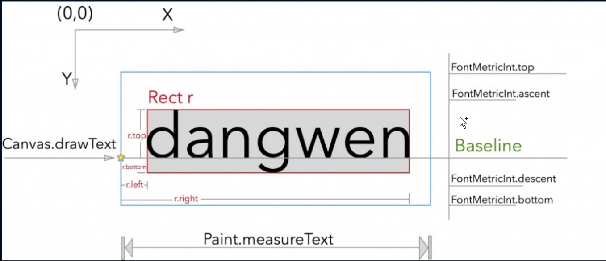

# TextView

## 基准线



```java
// 获取基线  baseLine
Paint.FontMetricsInt fontMetricsInt = mChangePaint.getFontMetricsInt();
//fontMetricsInt.bottom为正数，fontMetricsInt.top为负数
//(fontMetricsInt.bottom - fontMetricsInt.top) / 2 = 蓝框一半的高度
//蓝框的一半 - fontMetricsInt.bottom = dy
int dy = (fontMetricsInt.bottom - fontMetricsInt.top) / 2 - fontMetricsInt.bottom;
//View坐标系的中间坐标 + dy = View坐标系中的基准线Y坐标位置
int baseLine = getHeight() / 2 + dy;
```

