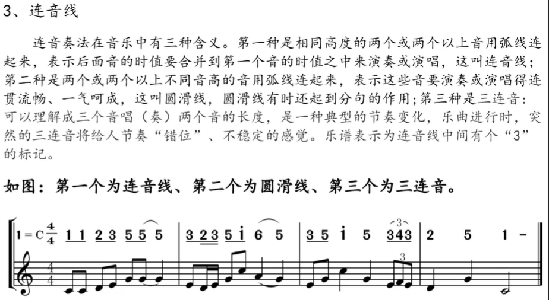
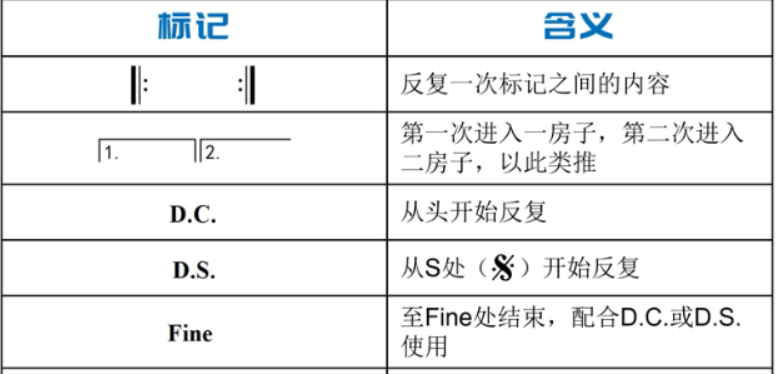

# 乐理

**参考资料：https://www.bilibili.com/video/BV1f64y1t7Ff**

五线谱是从下往上数

2个黑线左侧的音是do

高音谱号：下加1是中央C，第三间，上加二
低音谱号：上加1是中央C，第二间，下加二

二个黑键左下角是C，三个黑键的左下角是F

## 手位

C手位：右手的一指放在C上，其他手指依次一个白键

C+手位：右手的一指放在C+上，其他手指依次一个白键

F手位：右手的一指放在F上，其他手指依次一个白键

## 简谱、唱名、音名

| 简谱  | 唱名  | 音名  |
| --- | --- | --- |
| 1   | Dol | C   |
| 2   | re  | D   |
| 3   | mi  | E   |
| 4   | fa  | F   |
| 5   | sol | G   |
| 6   | la  | A   |
| 7   | si  | B   |

## 钢琴键盘图


## 谱表


## 音符


## 休止符


## 附点音符


## 全音和半音的关系

在乐音体系的音列中，相邻的两个音之间最小的距离叫半音，两个半音距离构成一个全音。(相邻两个琴键(包括白键和黑键)构成全音;相隔一个琴键的两键之间构成半音。)

## 变音符号


## 连音线



## 踏板

最右侧踏板：延音踏板

快节奏歌曲一般不会踩延音踏板

踏板运要点
1.换踏板脚跟为支点踩

2.换踏板要干脆利落

3.跟着左手每个小节的第一个音换踏板

## 反复记号



## 八度记号


## 常见拍子


## 常见8拍子


6拍的节奏，手可以画三角形

## 音程


**例:**

**DO到MI**

度数:3

DO到RE是全音，RE到MI是全音

2个全音构成(2个1)的是大三度


**RE到FA**

度数3

RE到MI是全音，MI到FA是半音

1个全音和一个半音(一又二分之一)构成的是小三度


纯音程听起来很舒适

大音程和小音程听起来不完全和谐

增、减听起来完全不和谐，比较刺耳


**为什么一度、四度、五度和八度是纯音程**

在乐理中，纯一度、纯四度、纯五度和纯八度被称为纯音程，因为它们在音高上具有简单的数学关系，这种关系在声音的振动频率上也是最简单的整数比。这些音程被认为是“纯”的，因为它们在和声上非常稳定，听起来非常和谐。下面是为什么这些音程是纯的：

1. **纯一度（Perfect Unison）**：
   
   - 纯一度是指两个音的频率完全相同，即频率比为1:1。它们听起来就像是同一个音，因此被称为“纯”。

2. **纯四度（Perfect Fourth）**：
   
   - 纯四度是指两个音的频率比为4:3。这个比例在音乐中被认为是非常和谐的，因为它可以由两个音符的泛音列中的共同泛音构成。

3. **纯五度（Perfect Fifth）**：
   
   - 纯五度是指两个音的频率比为3:2。这是音乐中最基本的和谐音程之一，因为它的泛音列中包含了共同的泛音，听起来非常悦耳。

4. **纯八度（Perfect Octave）**：
   
   - 纯八度是指两个音的频率比为2:1。这是最简单的频率加倍关系，听起来就像是同一个音高，但是一个音比另一个音高一个八度。

这些纯音程的和谐性来自于它们在物理振动上的简单比例关系，这些比例关系在声音的泛音列中能够产生共鸣，从而在听觉上产生稳定和和谐的效果。在西方音乐理论中，这些纯音程是构建和声的基础，并且经常在音乐作品中作为和声的支柱。


### 自然音程与变化音程

自然音程也叫基本音程，它是由音级中的两个基本音级之间所构成的音程。(注意:音程指的是两个音之间的高低关系，并不管构成音程中的音是否为基本音级或是变化音级。也就是说无论是由基本音级或是变化音级所构成的音程，只要它的音程度数与单纯的基本音级所构成的音程度数相同即是自然音程。)
变化音程是由自然音程变化而来的音程。它不可能由两个基本音级之间构成，只能出现在变化音级之间或是基本音级与变化音级之间。也就是说变化音程的名称不包括在自然音程的名称之中。

**自然音程**

基本音程中任何两个音的结合，可以构成下列各种基本音程:即纯音程、大音程、小音程、增四度和减五度音程。也就是说只要音程的名称是纯音程、大音程、小音程、增四度和减五度音程，那么它就是自然音程。

**变化音程**
变化音程是由自然音程变化而来的。即除去自然音程之外的一切音程都是变化音程。
它包括大音程、小音程、纯音程、增四度和减五度音程之外的一切增减音程和倍增、倍减音程，都叫做变化音程。

### 单音程与复音程

按照音程之间的距离大小，音程又可分为单音程与复音程两种类型。

**单音程**
构成音程的两音在纯八度(含纯八度)以内的，叫做“单音程”。一般来说，如果没有特别的说明，乐理中所提到的音程都为单音程。
**复音程**
超过纯八度的音程叫做复音程。

## 和弦

### 三和弦

**三和弦的定义**:三和弦的构成是由三个音按三度叠置而成的一种和弦,或称“三和音”。构成和弦的每一个音，都有名字:
**根音**:和弦最下面的音。这个音是和弦的基础，在和弦的原始排列中处于最低位置。

**三音**:根音上的三度音。在三和弦的原始排列中处于中间位置。

**五音**:根音上的五度音称为五音。在三和弦的原始排列中处于最高位置。

音阶各度均可作为根音，于其上方加入三音与五音而构成三和弦，每个和弦视其根音在音阶上的名称而命名。
三个音的名称，不会由于和弦的排列方式或位置的变化而更改。


(3)增三和弦
根音与三音，三音与五音都是大三度，用根音的大写英文字母音名加上aug或加一个“+”。如Do，Mi，升Sol和弦表示为Caug或C+，Fa，La，升Do 和弦表示为Faug 或F+。

(4)减三和弦
根音与三音，三音与五音都是小三度，用根音的大写英文字母音名加上dim或一个“。”。如Re，Fa，降La，表示为Ddim或D”，升Do，Mi，Sol表示为#Cdim或#C。

TIPS:

大三度比小三度多了个半音

C、F、G和弦是大三和弦

D、E、A和弦是小三和弦

### 和弦转位


第二转位我觉得应该是,图上是不是写错了?

```
  . .
5-1-3
```
